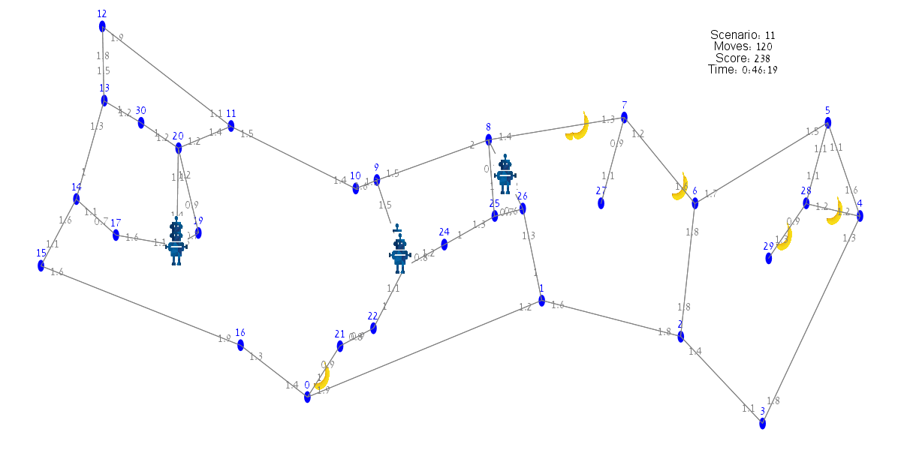

# Graph-Game
#### Author: Meir Nizri
This repository represents a graphical interface of a game. In this game there is a server, to which number of scenario are inserted. The scenarios are listed from 0-23. Each scenario has a graph, time, fruits, and robots. The purpose of the robots is to obtain as much points as possible. points are obtained by collecting fruits.

Each fruit has a location and value. After the fruit is collected and the number of points is obtained, the fruit appears elsewhere on the graph. There are two types of fruit:
  Banana - must be collected at the crossing on the edge from the high node to the low node.
  Apple - must be collected at the crossing on the edge from the low node to the high node.

## **GUI**
When the GUI activated, a white window will be displayed. There the user can choose how hr want to play the game by clicking the menu bar on "Game Start". The two options are::
  **Manual** - where first the user places the fruits on the graph, and After that the game begins. During the game the user chooses each robot where to go, by clicking on a node that is neighbor to the current node the robot is on.
  **Automatic** - where the user only runs the game and the robots collect the fruit relatively optimally, according to the algorithm in the GameManager class.

In the GUI, while the game is running you can see at any time: the number of the scenario currently being played, the number of moves, and the number of points collected up to the present time. At the end of the game, a message will be displayed showing the total number of points the robots have collected.

The menu in the graphical interface lets you choose two more options to save the game:
  **Save to KML** - save the last game played as KML file. you need to play first a game to operate this option. the file to save to must be with '.kml' suffix.
  **save as image** - save the current draw as .jpg or .png file.

To run the GUI, you must build a MyGamehGUI object with empty constructor.

## **Game Manager**
The class GameManager represents a game management system. It enables automatic (efficient) management of the robots. The constructor receives a 0-23 scenario from the server, places the robots optimally, and automatically moves the robots along the graph to collect as much fruit as possible.

The principle by which the game manager's algorithm works, is that every time a fruit location changes, each robot calculates for itself what fruit is most profitable for it at that moment, and builds the shortest path to it. The most profitable fruit is defined as the fruit to which the time is shortest relative to its value, concidering the robot's speed. This fruit will be the fruit on which the following calculation: **(fruitValue / (timeToFruit/robotSpeed))** is the largest.

## **Threads**
In this project we used during the game in another two more threads:
  The first **GameMoveThread** - operate "move" on the the game every tenth of a second. If the graph is activated automatically, a gameManager object is built. After every operation of move, the gameManager update the fruit location and the robots path. In addition, all information about the game is stored in a String variable in the form of KML. At the end of the game this variable is sent back to the GUI.
  The second **GameDrawThread** - updates the drawing of the game on the GUI every tenth of a second.

## **Game Object**
To simplify the game we used another two classes representing the following objects:
  **Fruit** - represents fruit on the overall game in this project. The purpose of this class is to represent all information in the fruit, so that the robots can gather as much fruits as possible in the fastest and most efficient way. The information every object contain is: type (apple or banana), location, the edge the fruit is currently on, the source node of the edge, the destination node of the edge, and the value of the fruit.
  **Robot** - represents robot on the overall game in this project. The purpose of this class is to represent all information in the robot, so that the robots can gather as much fruits as possible in the fastest and most efficient way. The information every object contain is: ID of the robot, speed, location, the source to his current edge he is on, the destination node he goes to, the path to the next fruit, and the current value of fruit he collected.

## **KML Logger**
As mentiond, the game can be saved as a KML file that can be run on Google Earth. There you can see the paths the robots have taken during the game. The location of the path in Google Earth is according to the location of the fruits and the graph, which are in the area of Ariel city.
  24 KML files are attached to the repositoryת File for every possible scenario in the game. You can enter these files into Google Earth and see the robot's path.

## **Game Data Base**
Another option in the GUI is to connect to a database and play the game by level. There are 11 defined level out of 24, which you must pass with certain result and with a certain number of moves (see image). Once a stage is passed, the following scenarios can be played. In this mode all the data about the game is saved in the database.

You can also access the database and retrieve data about the user or other players. Data such as: number of games played by the user, what the current level reached, what is his highest score at each level, and what is his position relative to all players at each level.

## **Graph**
To handle the drawing and all algorithms performed on the graph returned from the game server, we have added two packages that perform these two graphs operations:

### **Graph Data Structure** 
This package contains three types of data structures:
  **Node** - Represents a node in the graph. This data structure fields are: Key, Location, Weight (double), Tag (int), and Info (String).
  **Edge** - Represents an Edge in the graph. This data structure fields are: src, dest, Weight, Tag (int), and Info (String).
  **Graph** - Represents a Graph. This data structure fields are: nodes - HashMap of Nodes. adjacencyMap - HashMap of HashMaps. The key is the key of each node and the value is a HashMap containing all the edged exiting out of that node. Within this HashMap, the key is the destination key of each edge and the value is the edge itself. numEdges, mc.

### **Graph Algorithms** 
This package contains two types of classes:
  **graph algorithms** - represents the set of graph-theory graphAlgorithms. Such as: init from Json String, find shortest path (Dijkstra's algorithms), check if graph connected, write to file, and more.
  **graph functions** - represents set of static functions for graph GUI. Such as: find edge from point, find node from point, calculate distance from node, find range of x and y of graph.

## **Utilities**
In the project we used three well-known classes:
  **Point3D** - to indicate the location of each node
  **Range** - to calculate the GUI screen range.
  **StdDraw** - to draw the graph

## **Tests**
Each logical class has a Junit test class. We will use these classes to check the correctness of each class.

This project is my fourth assignment in Object Oriented Course at Ariel University. The course is led by Professor Boaz Ben-Moshe.
